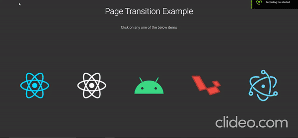

# Page Transition Example

### Brief explaination of the above example
1st page - listing page in this example,  
2nd page - description page in this example  

To make the illusion of shared element transition from page to page, a seperate element is created that is animated from the source element of the 1st page to the 2nd page's destination element.
 
The position and dimension of both the source and destination element is taken with the help of getBoundingClientRect and then these values are used for animating
 
This animation is shown on the 2nd page's mount and initially the 2nd page's content is hidden when the transitioning element is finished animating, then the content is displayed, after everything is done animating immediatly hide the transitioning element.

